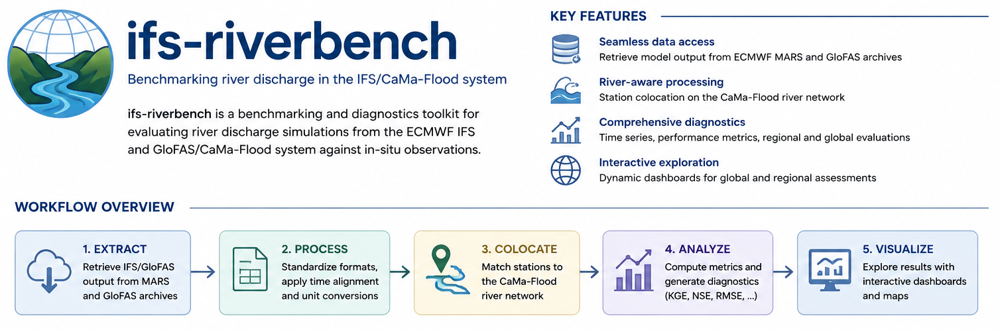

# ifs-riverbench

`ifs-riverbench` helps you compare river discharge experiments against observations and produce interactive HTML dashboards.

At a high level, you run a pipeline that:
1. retrieves model discharge data;
2. extracts time series at gauge stations;
3. computes benchmark metrics;
4. builds visual dashboards to compare experiments.

## Data availability

This repository ships code only. Two inputs are not included and are not required to explore the code:

- **Station metadata** (CaMa-Flood lookup CSV) — internal ECMWF asset.
- **Observed discharge** (the Qobs NetCDF/Zarr archive) — internal ECMWF asset, not redistributed here.

Both are available on request — open an issue on this repository or contact the maintainer directly. Paths shown below are examples; point `--station-file` / `--obs-file` at wherever you place your own copies.

## Quick Start 

If you are new to the workflow, follow these exact steps first.

### 1) Go to a large permanent directory

Your `$PERM` directory if available, or set PERM to on any permanent directory of your choice.

```bash
cd $PERM
```

### 2) Clone the repository

```bash
git clone https://github.com/gpbalsamo/ifs-riverbench.git
```

### 3) Move into the workflow directory

```bash
cd ifs-riverbench/Workflow
```

### 4) Run the full benchmark workflow

```bash
./ifs-riverbench.sh
```

This creates station data under `dashboard_data/` and HTML dashboards in `site_bundle/`.

### 5) Upload dashboards on sites (optional)

```bash
export ECMWF_RIVERBENCH_TOKEN="<set securely outside Git>"
python3 04_upload_dashboard.py --workflow-dir /perm/$USER/ifs-riverbench/Workflow --dashboard-dirname site_bundle
```

## What each script does

The workflow is organized around the scripts in `Workflow/`:

```text
Workflow/
├── 00_convert_qobs_to_zarr.py      # optional one-time conversion of observations to Zarr
├── 00_extract_rivers_mars.py       # retrieve river discharge GRIB files from MARS
├── 01_extract_hydrographs.py       # extract station hydrographs and compute metrics
├── 02_build_dashboard.py           # create interactive HTML dashboards
├── 03_prepare_sites_bundle.py      # prepare a single directory to upload
├── 04_upload_dashboard.py          # upload generated dashboards to ECMWF Sites
├── benchmark_cmf_vs_glofas5.py     # dedicated CaMa-Flood vs GloFAS benchmark engine
├── benchmark_cmf_vs_glofas5.sh     # launcher for the long-period benchmark
├── build_benchmark_html_index.py   # build HTML index pages for benchmark plots
└── ifs-riverbench.sh               # end-to-end driver script
```

## Detailed usage

## Inputs

### IFS river discharge from MARS

`00_extract_rivers_mars.py` retrieves GRIB files using this archive convention:

```text
date = first day of month
time = 00 UTC
step = 24, 48, 72, ... up to month end
```

Example January request:

```text
date = 20180101
step = 24/to/744/by/24
```

Typical output path:

```text
/perm/<user>/flood_cases/grib/<expver>/<date_start>_<date_end>/
```

### Station metadata

Not distributed with this repository — see [Data availability](#data-availability). Expected CSV contains station location and CaMa-Flood lookup columns, for example:

```text
Id, Name, StatLon, StatLat, ProvArea, River, Country,
Cama1lon, Cama1lat, Cama1area, ...
Cama3lon, Cama3lat, Cama3area, ...
Cama6lon, Cama6lat, Cama6area, ...
Cama15lon, Cama15lat, Cama15area, ...
```

Pass its location with `--station-file`, e.g.:

```text
/perm/${USER}/flood_cases/Stations/allstations_V1_2.csv
```

### Observed discharge

Not distributed with this repository — see [Data availability](#data-availability). Once you have your own copy, use NetCDF or Zarr; Zarr is recommended for speed in long multi-experiment runs. Pass its location with `--obs-file`, e.g.:

```text
/perm/${USER}/flood_cases/Stations/Qobs_24_1980-2025_withcaravan.nc
/perm/${USER}/flood_cases/Stations/Qobs_24_1980-2025_withcaravan.zarr
```

## Optional one-time prep

Convert observations to Zarr:

```bash
python3 00_convert_qobs_to_zarr.py
```

Recommended chunking:

```text
time=365, station=1024
```

## Step-by-step commands

### Step 1: retrieve discharge from MARS

Single experiment:

```bash
python3 00_extract_rivers_mars.py \
  --expver iyp3 \
  --date-start 20180101 \
  --date-end 20221231
```

Multiple experiments:

```bash
python3 00_extract_rivers_mars.py \
  --expver j6ft j6fu j6fs j6gq iyp3 \
  --date-start 20180101 \
  --date-end 20221231
```

Key options:

```text
--expver       one or more experiment IDs
--date-start   start date (YYYYMMDD or YYYY-MM-DD)
--date-end     end date (YYYYMMDD or YYYY-MM-DD)
--out-root     output root for GRIB files
--req-root     output root for saved MARS request files
--params       MARS parameter list (default: 235270)
--overwrite    overwrite existing GRIB files
--dry-run      write requests only, do not retrieve
```

### Step 2: extract station hydrographs and metrics

With Zarr observations:

```bash
python3 01_extract_hydrographs.py \
  --expver iyp3 \
  --date-start 20180101 \
  --date-end 20221231 \
  --resolution 15 \
  --valid-time-shift-hours -24 \
  --obs-file /perm/${USER}/flood_cases/Stations/Qobs_24_1980-2025_withcaravan.zarr
```

With NetCDF observations:

```bash
python3 01_extract_hydrographs.py \
  --expver iyp3 \
  --date-start 20180101 \
  --date-end 20221231 \
  --resolution 15 \
  --valid-time-shift-hours -24 \
  --obs-file /perm/${USER}/flood_cases/Stations/Qobs_24_1980-2025_withcaravan.nc
```

Why `--valid-time-shift-hours -24` is often needed: monthly archive files are stored with `date=first day of month`, while each `step` represents a later valid day.

Output layout:

```text
dashboard_data/<expver>/<date_start>_<date_end>_<resolution>arcmin/
├── stations/
│   ├── station_000000.json
│   ├── station_000001.json
│   └── ...
├── stations_catalog.json
└── global_station_metrics.csv
```

### Step 3: build dashboards

#### A) Best metric mode

```bash
python3 02_build_dashboard.py \
  --expver j6ft j6fu j6fs j6gq iyp3 \
  --date-start 20180101 \
  --date-end 20221231 \
  --resolution 15 \
  --metric kge \
  --colour-mode best_metric
```

#### B) Best experiment mode

```bash
python3 02_build_dashboard.py \
  --expver j6ft j6fu j6fs j6gq iyp3 \
  --control-expver iyp3 \
  --date-start 20180101 \
  --date-end 20221231 \
  --resolution 15 \
  --metric kge \
  --colour-mode best_experiment \
  --best-experiment-min-improvement 0.02
```

#### C) Pairwise difference mode

This mode computes:

```text
second experiment - first experiment
```

Example (`j6fu - iyp3`):

```bash
python3 02_build_dashboard.py \
  --expver iyp3 j6fu \
  --date-start 20180101 \
  --date-end 20221231 \
  --resolution 15 \
  --metric kge \
  --colour-mode experiment_difference \
  --difference-threshold 0.02
```

Useful dashboard options:

```text
--metric                              kge or correlation
--colour-mode                         best_metric, best_experiment, experiment_difference
--control-expver                      control experiment for best_experiment mode
--best-experiment-min-improvement     threshold above control
--difference-threshold                neutral threshold for pairwise differences
--map-height-vh                       map height (viewport units)
--river-resolution                    110m, 50m, 10m
--projection                          equirectangular or natural earth
--no-rivers                           disable river overlay
```

## Full driver script

Run everything end-to-end with:

```bash
bash ifs-riverbench.sh
```

The driver executes:
1. extraction from MARS;
2. hydrograph and metric extraction;
3. dashboard generation (best metric, best experiment, and pairwise differences);
4. preparation of a single upload bundle directory.

## Parameter convention

```text
235270 = river discharge
235275 = flood fraction
```

Current workflow focus is `235270`.

Edit the settings at the top of `ifs-riverbench.sh` to change the experiment list, metric, reference experiment, threshold or map height.

## Upload dashboards to ECMWF Sites

Set your ECMWF Sites token (e.g. in `~/.profile`):

```bash
export ECMWF_RIVERBENCH_TOKEN="<set securely outside Git>"
```

Upload the whole bundle directory (HTML dashboards, index page, and `dashboard_data/`) recursively:

```bash
python3 04_upload_dashboard.py
```

Dry run:

```bash
python3 04_upload_dashboard.py --dry-run
```

Useful options:

```text
--workflow-dir                 directory containing the dashboard bundle directory
--dashboard-dirname            name of the bundle directory to upload (default: site_bundle)
--remote-dashboard-dir         remote path to upload into (default: discharge-dashboard)
--list-before                  list remote files before upload
--list-after                   list remote files after upload
--dry-run                      print actions without uploading
```

The upload script reads the token from the `ECMWF_RIVERBENCH_TOKEN` environment variable. Do not hard-code API tokens in the repository.

## Viewing dashboards locally

From the `Workflow/` directory:

```bash
python3 -m http.server 8000
```

Then open:

```text
http://localhost:8000/
```

The dashboards fetch station JSON files from `dashboard_data/`, so opening the HTML file directly from the filesystem may not work in all browsers.

## Generated files and Git

Generated dashboard outputs should not normally be committed. The repository should ignore:

```text
dashboard_data/
global_station_dashboard_*.html
*.zarr/
*.npz
__pycache__/
```

Commit the workflow scripts, not the generated benchmark outputs.

## Requirements

The workflow requires access to ECMWF MARS and the `mars` command.

Main Python dependencies:

```text
numpy
pandas
xarray
dask
scipy
eccodes
plotly
cartopy
zarr
```

The upload step additionally requires the `sitesctl` CLI (not a pip package):

```bash
module load sites
```

## Notes

- Use Zarr observations for multi-year, multi-experiment benchmarks.
- Use `--valid-time-shift-hours -24` with the current monthly archive convention.
- For `experiment_difference`, remember that the result is always `second experiment - first experiment`.
- For `best_experiment`, use `--control-expver` and a non-zero improvement threshold to avoid over-interpreting negligible differences.

## Conda environment

A pinned `environment.yml` is provided to reproduce the Python environment used
by the workflow (Python 3.12, conda-forge builds of the ecCodes/Magics/NetCDF/
PROJ binaries plus the pip packages that link against them).

Create the environment:

```bash
module load conda            # on ECMWF HPC; otherwise ensure conda/mamba is available
conda env create -f environment.yml
```

Activate it before running the workflow:

```bash
conda activate ifs-riverbench
```

To update an existing environment after `environment.yml` changes:

```bash
conda env update -f environment.yml --prune
```

Notes:

- The environment is named `ifs-riverbench` (change the `name:` field in
  `environment.yml` to install it under a different name).
- `04_upload_dashboard.py` shells out to the `sitesctl` CLI rather than a pip
  package: the `sites` package on public PyPI is an unrelated third-party
  package, not ECMWF's Sites tool. On ECMWF HPC, run `module load sites`
  before the upload step.
  The extraction and dashboard-build steps (00–02, 04) do not require it.
